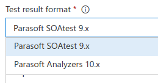
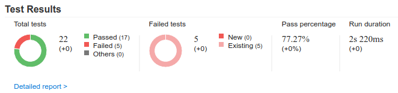
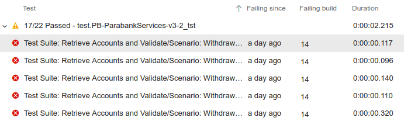
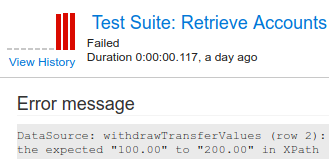

# Parasoft Findings for Visual Studio Team Services

The Parasoft Findings extension is designed to be used in a post test-execution build step that integrates functional and unit test reports generated by Parasoft tools into your Visual Studio Team Services project. The task will collect test results from the Parasoft report XML files and display the number of passed/failed tests and result details. The results can also be displayed as trending data in a graph for a simple visualization.

The extension can consume the following report types:

* Parasoft SOAtest 9.x XML reports.
* Parasoft Analyzers 10.x XML reports generated by Parasoft C/C++test, Jtest and dotTEST tools.

## Requirements

* Agent version 2.0.0 or higher.
* Java 6 or higher available on the host path.

## Installing the Parasoft Findings Extension
1. Sign in to the **Visual Studio Marketplace > Visual Studio Team Services**.
1. Find and select the Parasoft Findings Extension.
1. Click **Install**

See Visual Studio Team Services "Get extensions for Visual Studio Team Services" documentation page for additional information.

## Configuring the Extension

1. Edit an existing build or create a new build, then click **Add Task**
1. Search for **Publish Parasoft Test Results** in the search field, select the extension and click **Add**
1. In the configuration section section choose the **Test result format**:

1. Review the **Report location pattern** field. The Ant style file selection pattern in this script controls what Parasoft XML report files to include in the Vistual Studio Team Services build report.
1. Click **Save** under the **Save & Queue** menu when finished.
 
## Running the Build

A typical build configuration would consist of the following steps:
1. Clean the build checkout directory. In this step you will clean the Parasoft XML report files left over from the previous build runs. You can configure the following options:
    - Set the **Clean** option to true under the **Get sources** step.
    - Configure a *Command Line* runner to clean the Parasoft XML report files left over from the previous runs. For instance, you could run the following command to remove all XML files from the build Checkout Directory: rm $(System.DefaultWorkingDirectory)/*.xml
1. Run SOAtest, C/C++test, Jtest or dotTEST. This step will generate report files in XML format. The XML report files must be saved in the Vistual Studio Team Services build project Checkout Directory.
1. Run the Parasoft Findings extension. You can have multiple Parasoft tool runs that would generate multiple XML report files prior to invoking this build step. If the build steps prior to the Parasoft Findings extension build step generate multiple XML report files all test results from all these files will be added to the Vistual Studio Team Services build results.

## Viewing Results of the Last Build

Open the Vistual Studio Team Services build configuration page and click on the last build results link next to the build name. The build results pages contain the appropriate Parasoft tool report details:

The build results overview page tab provides the success and error count:

The build results shown in the **Tests** tab will contain the list of all Parasoft tests that ran in the build.

Clicking the **Build** step in the build tree displays logging information in case debugging is needed.

## Viewing Statistics and Trends

The build results overview page provides a histogram of the number of failing tests for each run. The dashboard also provides widgets for overall test result trends.

To view historical details of a particular Parasoft test, click the test you are interested in and click **View History**. A page with the detailed test history will open.

