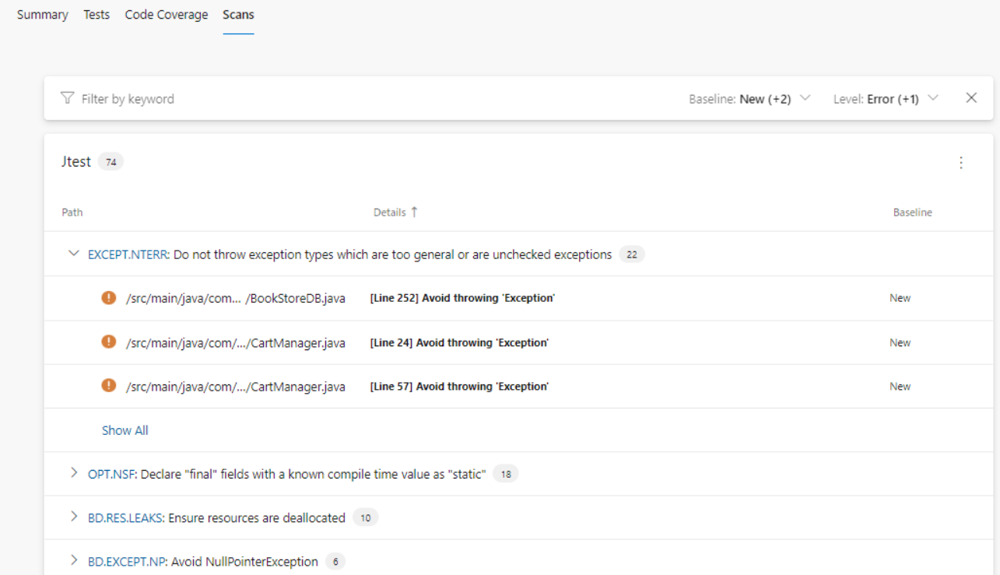
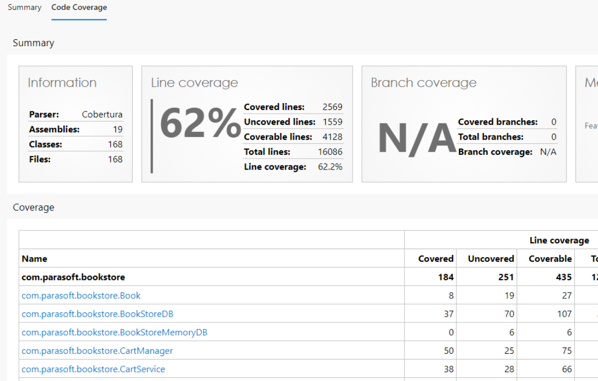
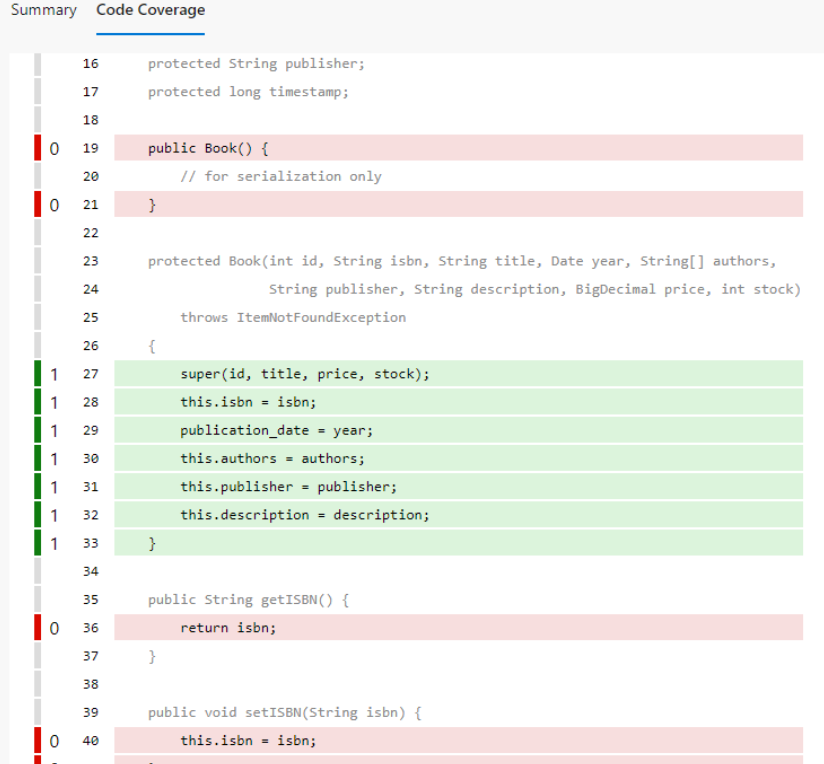

# Parasoft Findings for Azure DevOps
Integrate Parasoft SOAtest functional test results, unit test results, static analysis results and coverage results from C/C++test, Jtest, and dotTEST into your workflow

**Collect test results from Parasoft test case executions**
***

Aggregate test result information from all of your test case executions into one consolidated report.

**Associate test results to individual test cases**
***

Tie together test cases to their pass/ fail metadata such as assertion details or event logs.

**Visualize test execution trending data**
***

Understand your test results over time to see if you are trending in the right direction.

**Visualize static analysis results**
***

**Visualize code coverage results**
***

View which lines are covered or uncovered.

## More details
The Parasoft Findings extension is designed to be used in a post test-execution build step that integrates static analysis, code coverage, functional and unit test reports generated by Parasoft tools into your Azure DevOps project. The task will collect static analysis, code coverage and test results from the Parasoft report XML files.
- For static analysis results, this plugin has been integrated with the [SARIF SAST Scans Tab](https://marketplace.visualstudio.com/items?itemName=sariftools.scans) to visualize static analysis results. Navigation to rule documentation is also available.
- For code coverage, this plugin has been integrated with ths [Code Coverage Tab](https://learn.microsoft.com/en-us/azure/devops/pipelines/test/review-code-coverage-results?view=azure-devops) to visualize line coverage results.
- For test results, the number of passed/failed tests and result details will be displayed. Trending data in a graph for a simple visualization is also available.
