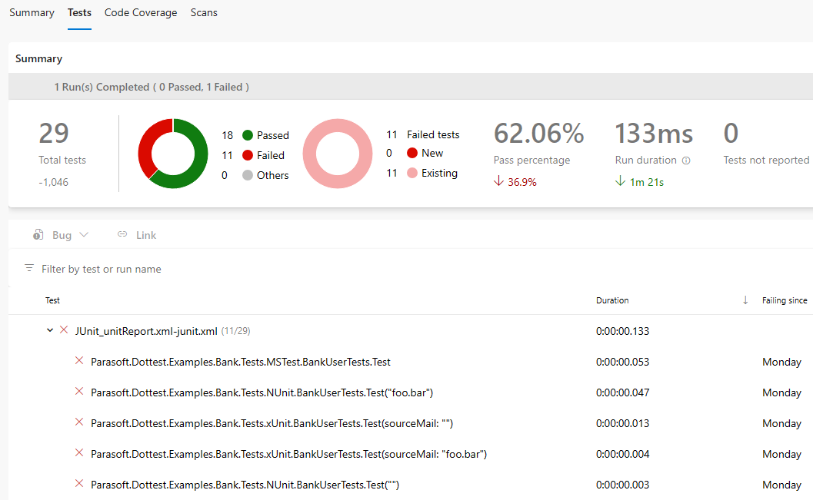

# Parasoft Findings for Azure DevOps
Integrate Parasoft SOAtest functional test results and unit test results from C/C++test, Jtest, and dotTEST into your workflow

**Collect test results from Parasoft test case executions**
***

Aggregate test result information from all of your test case executions into one consolidated report.

**Associate test results to individual test cases**
***

Tie together test cases to their pass/ fail metadata such as assertion details or event logs.

**Visualize test execution trending data**
***

Understand your test results over time to see if you are trending in the right direction.

## More details
The Parasoft Findings extension creates a post test-execution task that integrates your Azure DevOps project with Parasoft SOAtest 9.x functional test results and Parasoft C/C++test & Jtest unit test results. The task will collect test results from the Parasoft report XML, and display these results in the form of pass/fail indications and result details. The results can also be displayed as trending data in graph form, for additional analysis.
